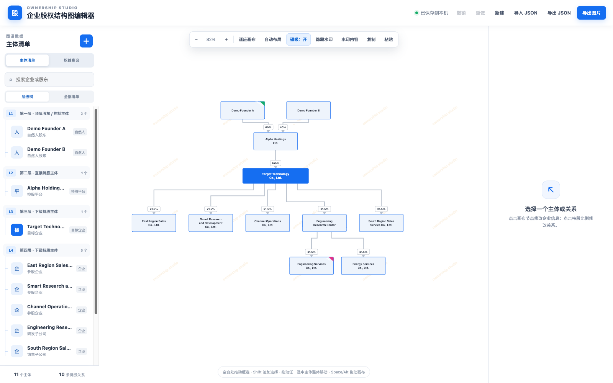
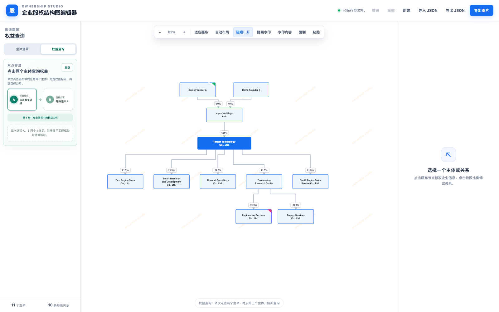
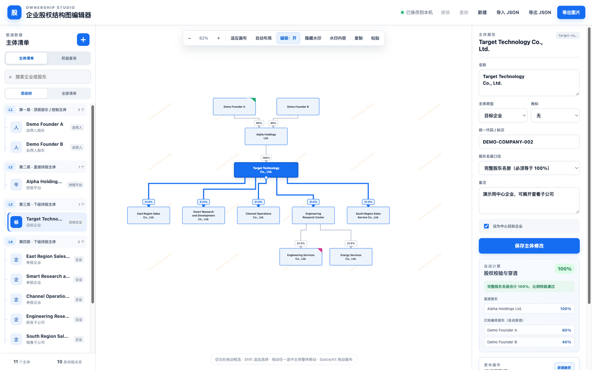

# 企业股权结构图编辑器

一个可在浏览器本地运行的企业股权结构图编辑器。它面向股权研究、投融资分析和内部数据整理场景，帮助你把股东、目标企业、子公司及其持股关系整理成可编辑的关系图。

项目默认使用完全虚构的演示数据启动，所有编辑数据默认保存在当前浏览器的本机存储中，不需要后端服务或账号。

## 界面截图

默认股权结构总览：



权益穿透查询：



主体属性、股权校验与自动穿透结果：



截图只使用仓库内的合成演示数据，不包含真实企业或个人资料。

## 功能

- 可视化新增、编辑和删除主体及持股关系
- 支持主体类型、统一代码/标识、备注、中心目标企业和股东名册口径
- 支持拖拽、缩放、画布平移、框选、多选移动、复制粘贴、撤销/重做
- 自动布局、参考线和磁吸，降低复杂股权图的整理成本
- 校验持股比例、重复股东、自持、自然人被投、完整股东名册等数据问题
- 查询任意两个主体之间的直接及间接已知权益，并标记循环或不完整路径
- 按投后比例，或按投前估值与投资额，模拟纯增资融资及原股东稀释
- 自定义或隐藏水印，并导出 JSON 数据和 PNG 图片

## 快速开始

环境要求：Node.js 18 或更高版本，以及 npm。

```bash
npm install
npm run dev
```

然后打开 <http://localhost:3000/>。

也可以使用生产构建：

```bash
npm run build
npm run preview
```

## 数据口径

持股关系的方向是 `股东 -> 被投主体`，例如 `A -> B: 60%` 表示 A 持有 B 的 60%。间接权益按路径中各段比例相乘，再汇总所有有效路径。

主体的股东名册口径分为两种：

- `仅录入已知股东`：允许已知比例低于 100%，结果会标记未披露部分。
- `完整股东名册`：已知持股比例需要合计为 100%（允许显示层面的微小舍入误差）。

权益穿透和融资测算只基于当前图谱中已经录入的数据。存在无效比例、循环路径或部分披露时，应用会提示结果不完整；这些计算不构成法律、审计、税务或投资建议。

## 数据保存与导出

- 数据保存在浏览器的 `localStorage`，清理浏览器站点数据会删除本地文档。
- 使用“导出 JSON”保存可迁移的数据文件，使用“导入 JSON”恢复文档。
- 项目不会把图谱数据发送到服务器；图片导出在浏览器本地完成。
- `src/equity-data.js` 中的示例数据是合成数据，仅用于演示交互，可直接替换为自己的示例数据。

## 隐私与公开范围

- 仓库不应包含真实企业股权资料、个人信息、未公开商业数据、访问令牌、密码或本地构建产物。
- 应用没有后端接口、账号系统或遥测逻辑；用户输入的数据只保存在当前浏览器中，只有在用户主动导出时才会生成文件。
- 导出的 JSON 可能包含用户录入的敏感信息。请在分享、提交 Issue 或 Pull Request 前先脱敏，不要把真实数据文件提交到仓库。
- 开发服务器和预览服务器默认只监听本机回环地址，避免无意中向局域网暴露本地数据。
- 公开发布前应检查暂存区内容和提交记录，确认没有邮箱、密钥、绝对路径或其他不应公开的信息。

## 开发命令

```bash
npm test       # 运行核心计算和布局测试
npm run build  # 执行 Vite 生产构建
npm run dev    # 启动本地开发服务器
```

提交改动前请至少运行 `npm test` 和 `npm run build`。更多协作约定见 [CONTRIBUTING.md](CONTRIBUTING.md)；安全与隐私注意事项见 [SECURITY.md](SECURITY.md)。

## 技术栈

- 原生 JavaScript、HTML、CSS
- [Vite](https://vitejs.dev/)
- Node.js 内置测试运行器

## 项目来源与第三方依赖

### 项目来源

本项目早期以 RelationGraph 的 [relation-graph-startup-for-web-component](https://github.com/relation-graph/relation-graph-startup-for-web-component) 作为工程起点，并参考了 [RelationGraph](https://github.com/relation-graph/relation-graph) 的 Web Component 接入方式。当前版本已改为项目内的 SVG 图谱渲染和计算逻辑，源码不再直接加载 `@relation-graph/web-components`；保留上游链接和归属说明，便于追溯项目来源。

### 当前直接依赖

| 项目 | 类型 | 用途 | 许可证 |
| --- | --- | --- | --- |
| [Vite](https://github.com/vitejs/vite) | 开发依赖 | 本地开发服务器、生产构建和预览 | MIT |
| [Node.js](https://nodejs.org/) | 开发工具链 | 运行内置测试运行器和 npm 脚本 | Node.js 许可证 |

应用运行时只使用浏览器原生的 DOM、SVG、File、Blob 和 `localStorage` API，没有额外的生产 npm 依赖。Vite 的传递依赖及其许可证以 [package-lock.json](package-lock.json) 为准，主要包和上游归属见 [THIRD-PARTY-NOTICES.md](THIRD-PARTY-NOTICES.md)。

当前编辑器的图谱交互、计算逻辑和界面样式主要位于本项目的 `src/` 目录。使用或分发早期上游代码时，请同时遵守上游项目随附的许可证和版权声明。

## 使用许可与商业授权

本项目不是采用 MIT、Apache-2.0 等允许商业使用的开源协议，而是按 [专有软件许可](LICENSE) 提供源代码：

- 个人、学习、研究和其他非商业用途可以按照许可证使用和修改。
- 商业使用、销售、收费服务、SaaS/托管服务、商业再分发，或将本项目集成到商业产品中，必须事先取得版权所有者的书面授权。
- 商业授权申请邮箱：`1801467008@qq.com`。

“开源”与“禁止商业使用”在严格定义上互相冲突；当前许可选择优先满足商业授权要求。第三方依赖仍受其各自许可证约束；当前应用运行时不依赖第三方 npm 包。

## 免责声明

本工具用于信息整理和估算，不保证输入数据的完整性或准确性，也不替代律师、会计师、审计师或投资顾问的专业意见。使用者应自行核验企业登记、股东名册、协议安排和融资条款等原始材料。许可证文本是项目使用条件说明，不构成法律意见；正式商业合作建议由专业法律顾问审核。
